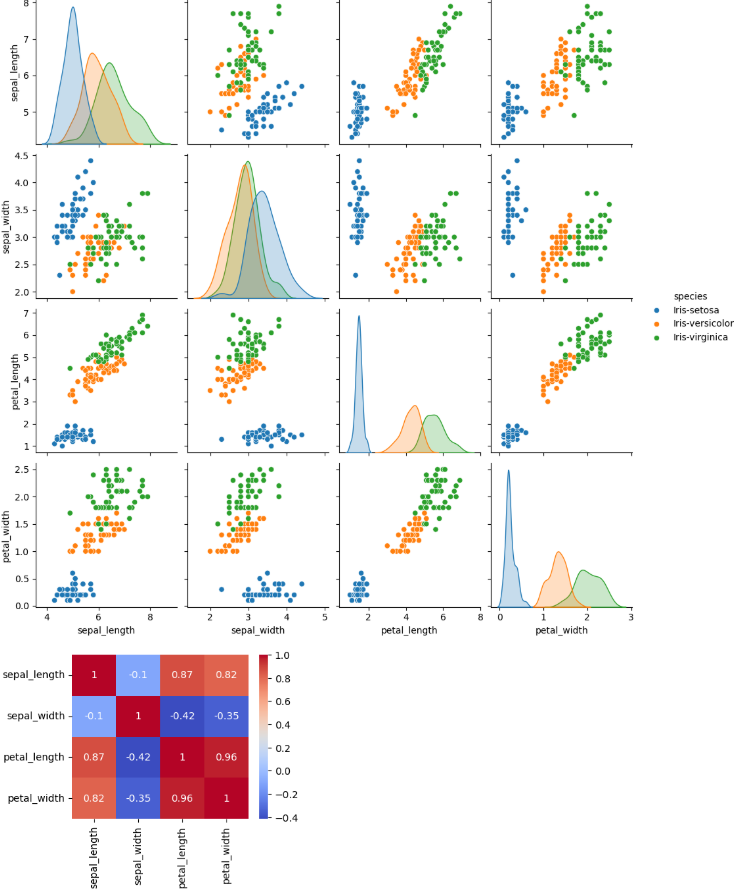
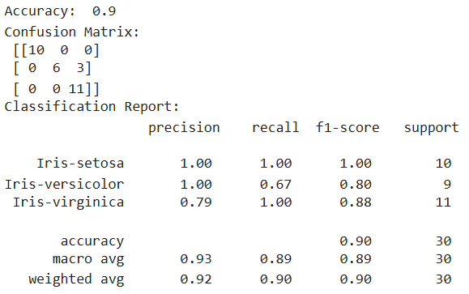

# 🌸 Iris Flower Classification using Machine Learning

This project was developed as part of my Machine Learning internship. The goal of the project is to classify iris flowers into one of three species—**Setosa**, **Versicolor**, or **Virginica**—based on their sepal and petal dimensions.
The project demonstrates the complete machine learning workflow, starting from data exploration and preprocessing to model training, evaluation, and prediction. It serves as a beginner-friendly classification project and provides practical experience with supervised machine learning algorithms.

## 🚀 Features

* Data preprocessing and exploration
* Exploratory Data Analysis (EDA)
* Feature visualization
* Model training and testing
* Iris flower species prediction
* Model performance evaluation

## 🛠️ Technologies Used

* Python
* Pandas
* NumPy
* Matplotlib
* Seaborn
* Scikit-learn
* Jupyter Notebook

## 📂 Project Structure

```text
iris-flower-classification/
│
├── data/
├── task2_iris_classification.ipynb
├── README.md
└── requirements.txt
```

## 📊 Workflow

1. Import the Iris dataset.
2. Explore and visualize the data.
3. Preprocess the dataset.
4. Split the data into training and testing sets.
5. Train the classification model.
6. Evaluate model performance.
7. Predict the species of new iris flower samples.

## 📊 Output

### Pair Plot



### Model Evaluation



### Heatmap


## 📈 Results

The trained model successfully classifies iris flowers into their respective species based on the provided measurements. The project demonstrates how machine learning can be used to solve multiclass classification problems with high accuracy.

---

*This project was completed as part of a Machine Learning internship to strengthen my understanding of data preprocessing, classification algorithms, and the end-to-end machine learning workflow.*
